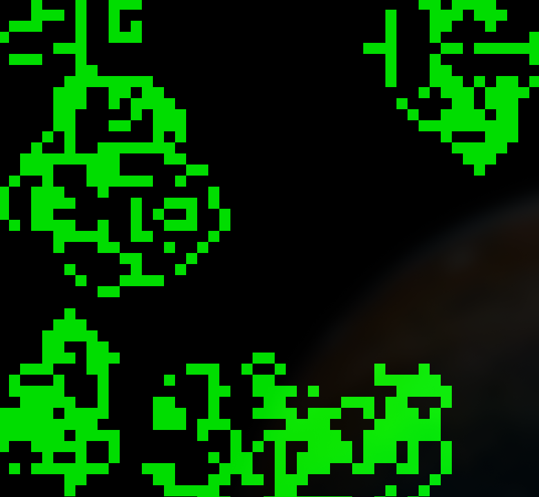
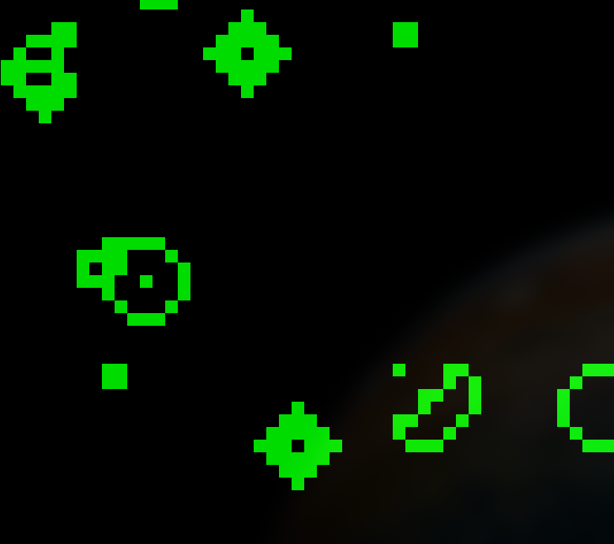

# Game of Life
This is my implementation of [Conway's game of life](https://en.wikipedia.org/wiki/Conway%27s_Game_of_Life).  
<p float="left">
  
  
</p>

## Running
To run this, you need to have [Java](https://www.oracle.com/java/technologies/downloads/) installed.  
Then, in the project root, just run  
```
$java src/gameoflife/Main.java
``` 
The game will first prompt you to input the edge behavior, grid size, and start position percentage, after which a window with the simulation will launch.

## Architecture
There are four classes:

### Main.java
App entrypoint, requests user input and instantiates GameLogic based on the input.

### Grid.java
Keeps track of the current game state by tracking for each cell a boolean if it is alive or dead. This class also contains a bunch of helpful methods, like initializing the grid randomly.

### GameLogic.java
Handles the game update loop, as well as calculating the next grid state each tick (which cells should be alive based on their previous neighbors.)

### GameOfLifeGUI.java
Create the visual GUI based on the current game state.
